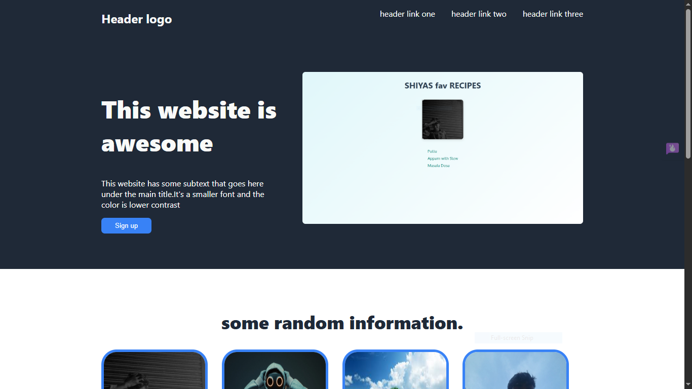

# Landing Page Project

A simple and responsive landing page built with raw HTML and CSS.  
This project is part of my learning journey to improve front-end development skills.

## Features

- Clean and minimal design
- Hero section with headline and subtext
- Call to action button
- Random information section with images
- Customer testimonial/quote section
- Footer with copyright

## Screenshots

## Learning Purpose

This project was created to:

- Practice writing raw HTML and CSS without frameworks
- Understand basic layout techniques using Flexbox
- Explore design elements such as buttons, sections, and images

## License

This project is licensed under the terms of the [LICENSE](./LICENSE) file.
